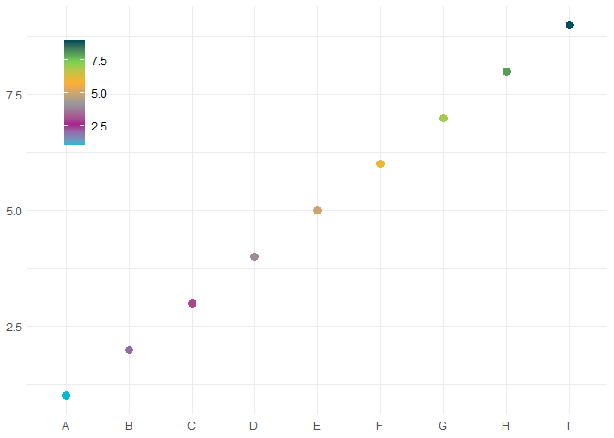
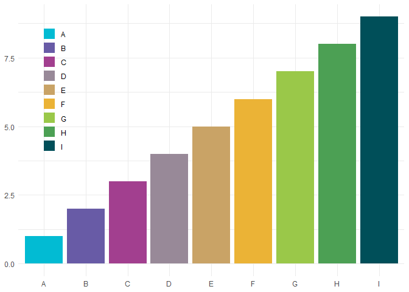
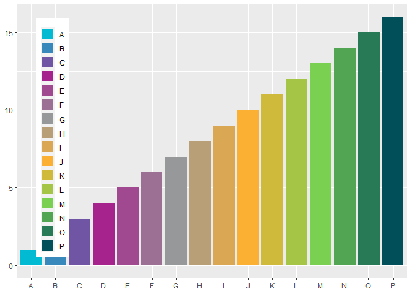
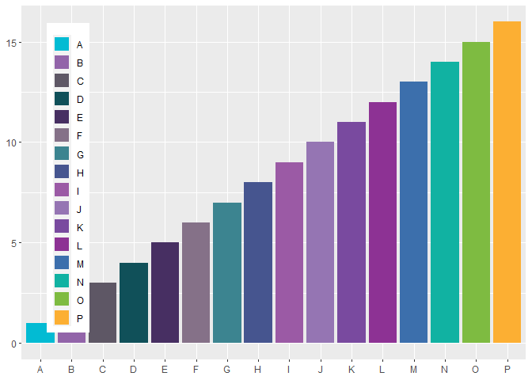
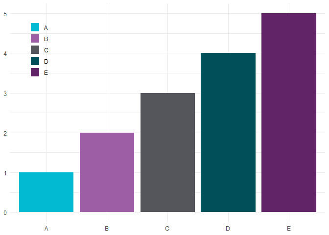
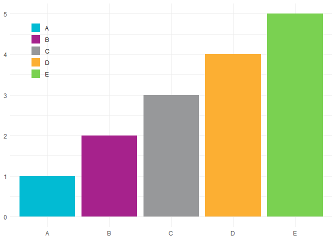

<!-- README.md is generated from README.Rmd. Please edit that file -->

# bccpalette

<!-- badges: start -->
<!-- badges: end -->

The goal of bccpalette is to create and use custom BC Cancer branding
colour palettes for ggplot2 graphs. Users can add and customize colours
and palettes by editing the raw data file `bcc_colours.R` and including
their own hex codes. A set of functions are provided to easily extract
colours from the palettes for plots.

## Installation

You can install the development version of bccpalette from
[GitHub](https://github.com/) with:

``` r
# install.packages("devtools")
devtools::install_github("BCCanDataAnalytics/bccpalette")
```

## Usage

Colours used in `bcc_colours.R` are housed in two lists,
`brand_cols_only` and `distinct_colours`. These two palettes are used in
the following examples.

``` r
bcc_colours = list(
  brand_cols_only = c("#02bbd3", "#9d5ea6", "#55565b", "#004f59", "#612466", "#97989a",
                               "#00788b", "#843794", "#b784ba", "#635faa", "#a6228c", "#4b5fab",
                               "#02b1b1", "#76bc43", "#fcaf33"),
  distinct_colours = c("#02bbd3", "#a6228c", "#97989a", "#fcaf33","#7AD151FF", "#004f59")
)
```

Here we generate a simple dataset to demonstrate how to use the
`scale_colour_bcc_c`, `scale_fill_bcc_c`, `scale_colour_bcc_d`, and
`scale_fill_bcc_d` functions.

``` r
library(bccpalette)
library(ggplot2)
library(dplyr)

df <-  
  data.frame(x = c("A", "B", "C", "D", "E", "F", "G", "H", "I"),
                y = 1:9)

g <- 
  ggplot(data = df,
           mapping = aes(x = x, y = y)) +
  theme_minimal() +
  theme(legend.position = c(0.05, 0.95),
        legend.justification = c(0, 1),
        legend.title = element_blank(), 
        axis.title = element_blank())

# tests...
g +
  geom_point(aes(colour = y), size = 3) +
  scale_colour_bcc_c("distinct_colours") #new function line for palette; replaces scale_colour_manual from ggplot
```



``` r
g +
  geom_col(aes(fill = x), size = 3) +
  scale_fill_bcc_d("distinct_colours", df$x) #new function line for palette; replaces scale_colour_manual from ggplot
```



This is also compatible when converting ggplot graphs to plotly. Here
are a few more examples with more arguments (n = 16) and fewer arguments
(n = 5).

``` r
#test with more colours
df <-
  data.frame(x = c("A", "B", "C", "D", "E", "F", "G", "H", "I", "J", "K", "L", "M", "N", "O", "P"),
                y = 1:16)
df %>% 
  ggplot(., mapping = aes(x = x, y = y)) +
  # theme_minimal() +
  theme(legend.position = c(0.05, 0.95),
        legend.justification = c(0, 1),
        legend.title = element_blank(), 
        axis.title = element_blank()) +
  geom_col(aes(fill = x), size = 3) +
  scale_fill_bcc_d("distinct_colours", df$x) #new function line for palette; replaces scale_colour_manual from ggplot
```



``` r
df %>% 
  ggplot(., mapping = aes(x = x, y = y)) +
  # theme_minimal() +
  theme(legend.position = c(0.05, 0.95),
        legend.justification = c(0, 1),
        legend.title = element_blank(), 
        axis.title = element_blank()) +
  geom_col(aes(fill = x), size = 3) +
  scale_fill_bcc_d("brand_cols_only", df$x) #new function line for palette; replaces scale_colour_manual from ggplot
```



``` r

#test with fewer colours
df <-  
  data.frame(x = c("A", "B", "C", "D", "E"),
                y = 1:5)

g <- 
  ggplot(data = df,
           mapping = aes(x = x, y = y)) +
  theme_minimal() +
  theme(legend.position = c(0.05, 0.95),
        legend.justification = c(0, 1),
        legend.title = element_blank(), 
        axis.title = element_blank())

g +
  geom_col(aes(fill = x), size = 3) +
  scale_fill_bcc_d("brand_cols_only", df$x)
```



``` r
g +
  geom_col(aes(fill = x), size = 3) +
  scale_fill_bcc_d("distinct_colours", df$x)
```


